# Windows Data Recovery Investigation

## Overview

This project demonstrates a forensic investigation involving deleted file recovery, Recycle Bin analysis, and overwrite behavior within a Windows NTFS environment.

The investigation focused on understanding how deleted data behaves after:
- standard deletion
- permanent deletion
- Recycle Bin clearing
- overwrite activity

Analysis was conducted using a forensic disk image acquired from a Windows virtual machine.

---

# Investigation Objectives

- Recover deleted files from NTFS
- Analyze Recycle Bin artifacts
- Perform signature-based carving
- Observe overwrite behavior
- Understand recovery limitations
- Document forensic workflow

---

# Scenario Description

A Windows environment was prepared to simulate realistic user activity involving:
- text document creation
- ZIP archive creation
- image transfers
- standard deletion
- permanent deletion

The following actions were performed during the scenario:

| Artifact | Action |
|---|---|
| PNG image | Deleted normally (Recycle Bin) |
| TXT documents | Permanently deleted using Shift + Delete |
| ZIP archives | Deleted after creation |
| 1GB dummy file | Created after deletion activity |

After the deletions, a large 1GB file was intentionally generated to simulate overwrite conditions and sector reuse.

The system was then shut down and acquired for forensic analysis.

---

# Evidence Acquisition

The Windows virtual machine disk was acquired from the Proxmox hypervisor using a raw imaging process.

## Acquisition Command

```bash
dcfldd if=/dev/pve/vm-101-disk-0 of=windows2.dd hash=sha256 hashlog=forensic.txt
```

---

# Evidence Verification

SHA256 hashes were generated to verify evidence integrity.

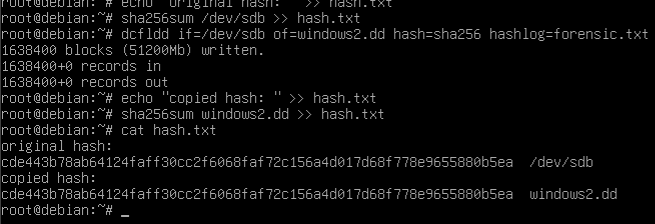

---

# Tools Used

| Tool | Purpose |
|---|---|
| Autopsy | Filesystem and timeline analysis |
| PhotoRec | Signature-based carving |
| FTK Imager | Evidence verification |
| dcfldd | Disk acquisition |
| Hex Viewer | File signature validation |

---

# Analysis Process

# 1. Loading the Evidence

The forensic image (`windows2.dd`) was loaded into Autopsy for:
- filesystem analysis
- deleted file recovery
- timeline reconstruction
- artifact inspection

## Screenshot 

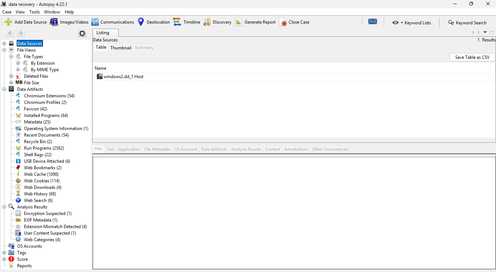

---

# 2. Recycle Bin Analysis

Analysis of the Recycle Bin showed evidence of normally deleted files.

The PNG image was identified as a standard deletion artifact and remained recoverable through filesystem metadata.

This demonstrated that:
- standard deletion preserves recoverability
- NTFS metadata structures remain intact until overwritten
  
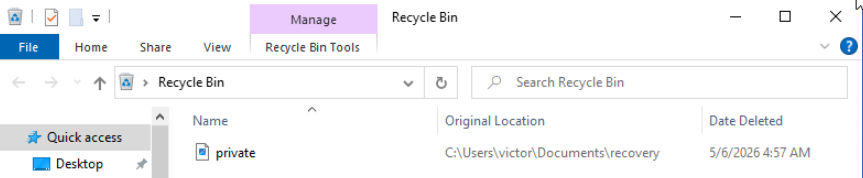
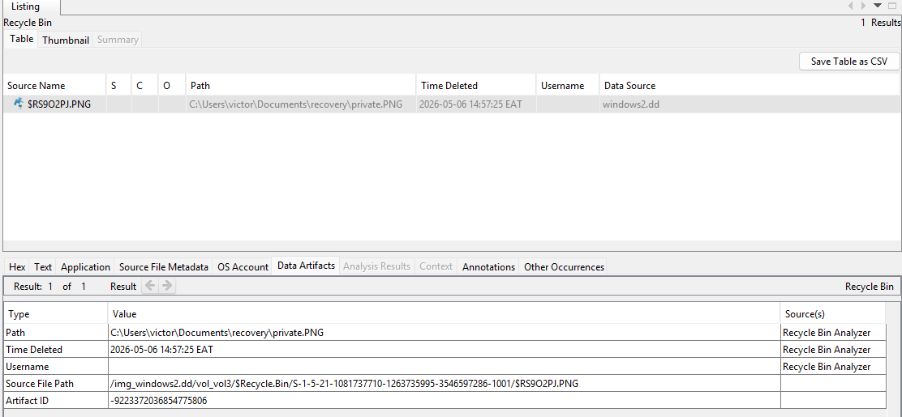
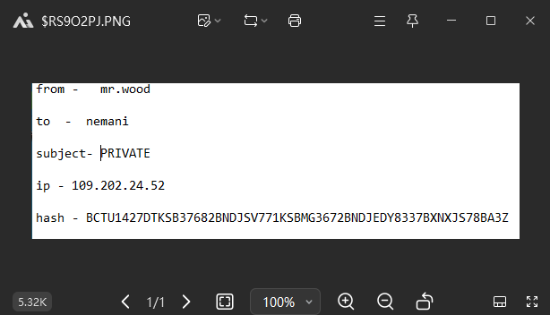
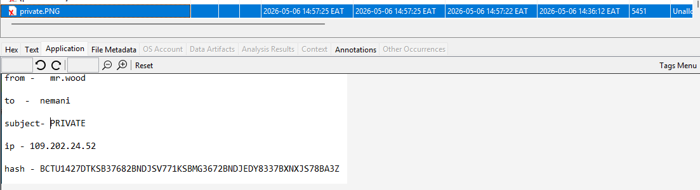


## Key Finding

The PNG image was recoverable because it was deleted normally rather than permanently removed.
---

# 3. Permanent Deletion Investigation

Several TXT files were permanently deleted using:
```text
Shift + Delete
```

Unlike standard deletion:
- files bypassed the Recycle Bin
- filesystem references were removed immediately
- recovery depended on surviving unallocated clusters

The deleted TXT files became primary recovery targets during carving operations.

## Screenshot Placeholder

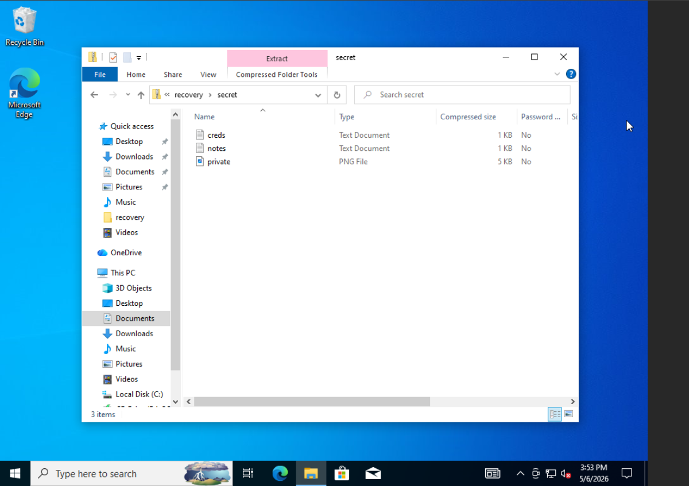

---

# 4. File Carving with PhotoRec

PhotoRec was used against the raw forensic disk image (`windows2.dd`) to perform signature-based carving from unallocated disk space.

Recovery attempts focused on:
- TXT documents
- ZIP archives
- PNG images

## Recovery Configuration

- Filesystem: NTFS
- Scan Mode: Free Space
- Recovery Types:
  - txt
  - png
  - zip

## Screenshot 

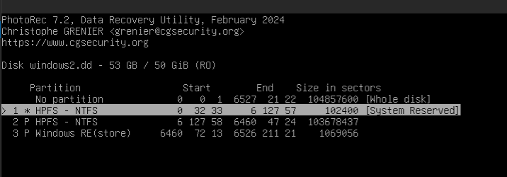
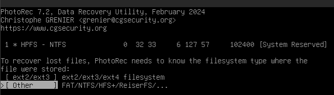
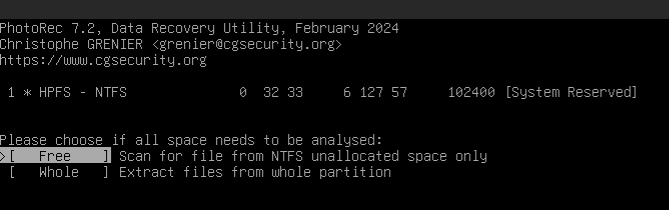
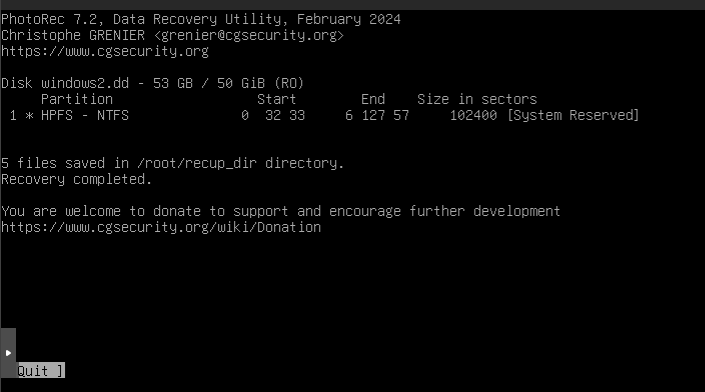

---

# 5. Recovery Results and Limitations

The carving process successfully identified recoverable filesystem artifacts and several non-user-generated objects from unallocated space.

Recovered artifacts included:
- fragmented ZIP structures
- system font files (`.ttf`)
- partial filesystem remnants
- miscellaneous unallocated artifacts

However, the permanently deleted TXT files were not recoverable.

No intact:
- TXT content
- TXT metadata
- original filenames
- directory paths

were recovered during the carving process.

## Screenshot Placeholder

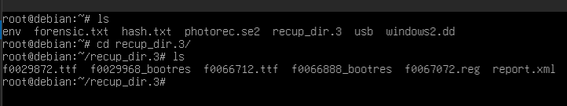

---

# Analysis of Recovery Failure

The absence of recoverable TXT artifacts is consistent with overwrite activity following permanent deletion.

After the TXT files were deleted using:
```text
Shift + Delete
```

a large 2GB file was intentionally created within the Windows environment.

This likely caused NTFS to reuse previously unallocated clusters that originally contained the deleted TXT data.

As a result:
- original sectors were overwritten
- file signatures became unrecoverable
- metadata structures were destroyed
- carving reliability significantly decreased

---

# Key Forensic Observation

This investigation demonstrated that permanent deletion alone does not immediately destroy file content; however, subsequent disk activity can rapidly reduce or eliminate recoverability through sector reuse.

The case highlights a critical forensic principle:

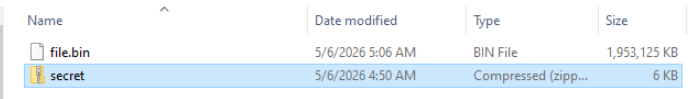

---

# Additional Findings

Although the target TXT files were not recoverable, PhotoRec successfully carved unrelated filesystem artifacts from unallocated space.

Recovered TrueType font artifacts confirmed that:
- carving operations were functioning correctly
- unallocated sectors still contained recoverable data
- selective overwrite had occurred rather than full disk destruction

## Screenshot


---

# Recovery Limitation Summary

| Observation | Result |
|---|---|
| TXT file recovery | Failed |
| Metadata recovery | Failed |
| File carving operation | Successful |
| Evidence of overwrite activity | Present |
| Non-target artifact recovery | Successful |

---

# Forensic Significance

The inability to recover the deleted TXT files provided valuable evidence regarding overwrite behavior and data survivability within NTFS environments.

Rather than indicating tool failure, the results demonstrated realistic forensic limitations encountered during post-incident recovery investigations.
